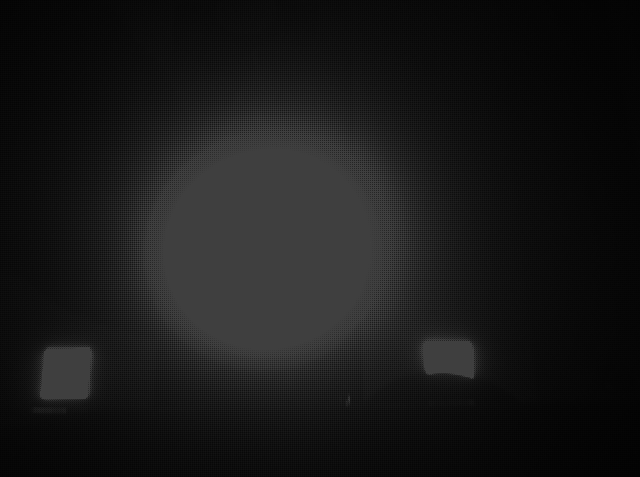
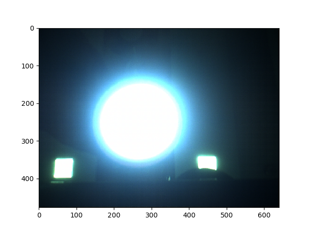
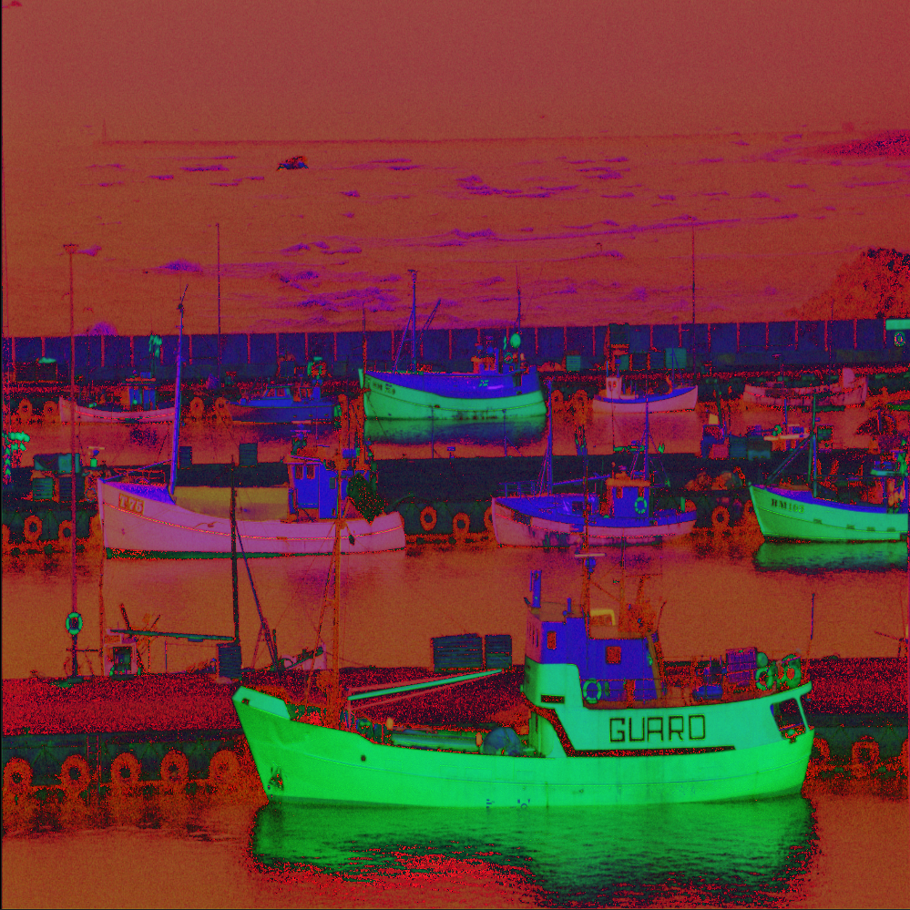
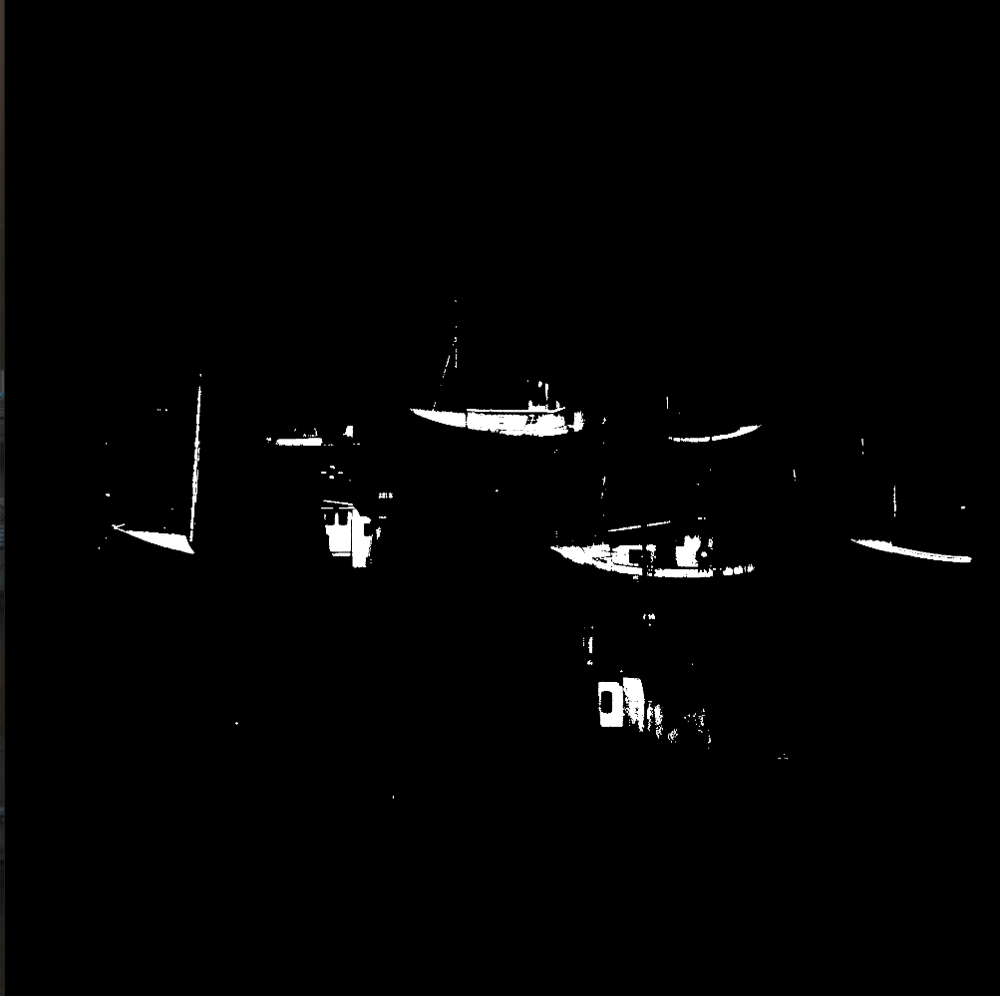
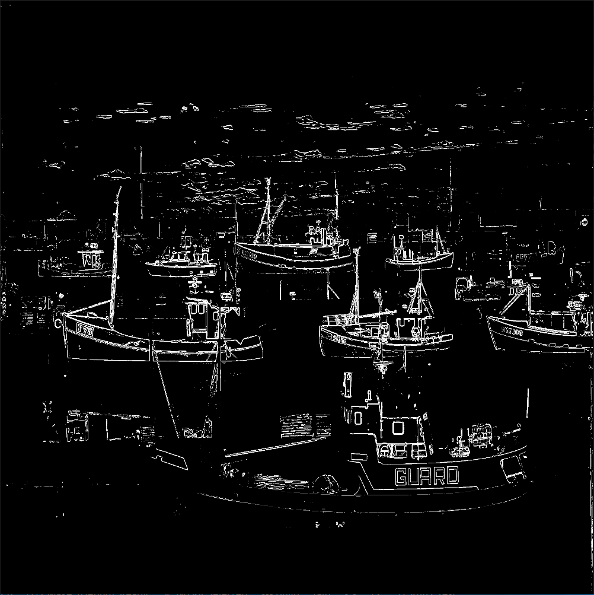
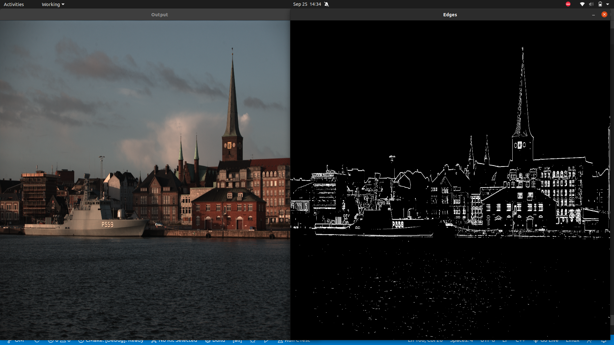
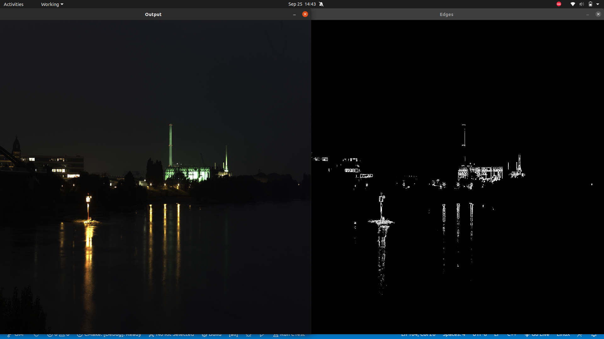
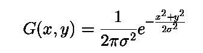

# Image Pipeline

The image pipeline takes raw image from sensor and convert it to meaningful image. Several algorithms like debayering, Black Level correction, auto-white balance, denoising.. will be first implemented to construct a meaningful image. Then additional algorithms can be implemented on the constructed image to post-process it. Like Flipping, blending and overlaying images. All algorithms will be implemented on a static raw image captured from a sensor. The first part of this project is similar to what happens in an ISP (Image Signal Processor) in which all algorithms are designed based on hardware, but we will be designing those such that they are hardware independent.

## CFA Image

## Debayering
Debayering, also known as demosaicing, is the process to convert a CFA image (m-by-n) to a true RGB color digital image (m-by-n-by-3).

## White Balancing

* Any object can look like any color, depending on the light illuminating it. To reveal the color that we would see as humans, what we need is a reference point, something we know should be a certain color (or more accurately, a certain chromaticity). Then, we can rescale the R, G, B values of the pixel until it is that color. 
* As it is usually possible to identify objects that should be white, we will find a pixel we know should be white (or gray), which we know should have RGB values all equal, and then we find the scaling factors necessary to force each channel's value to be equal. 
* As such, this rescaling process is called white balancing. 
* Once we do this for a single pixel, we will assume that the same illuminant is lighting the entire scene, and use these scaling values for all pixels in the image. 

#### Gray world assumption 
* The <b>Gray World Assumption</b> is a white balance method that assumes that your scene, on average, is a neutral gray. Gray-world assumption hold if we have a good distribution of colors in the scene. Assuming that we have a good distribution of colors in our scene,the average reflected color is assumed to be the color of the light. Therefore, we can estimate the illumination color cast by looking at the average color and comparing it to gray.

* <b>Gray world algorithm</b> produces an estimate of illumination by computing the mean of each channel of the image.

* One of the methods of method of normalization is normalizing to the maximum channel by scaling by ri.

ri = max(avgR + avgG + avgB) / avgi

## Gamma correction
* When twice the number of photons hit the sensor of a digital camera, it receives twice the signal (a linear relationship). However, that’s not how our human eyes work. 
* Instead, we perceive double the amount of light as only a fraction brighter (a non-linear relationship)! 
* Furthermore, our eyes are also much more sensitive to changes in dark tones than brighter tones (another non-linear relationship).
* In order to account for this we can apply gamma correction, a translation between the sensitivity of our eyes and sensors of a camera.

#### Gamma correction and the Power Law Transform

* Gamma correction is also known as the Power Law Transform. 
* First, our image pixel intensities must be scaled from the range [0, 255] to [0, 1.0]. From there, we obtain our output gamma corrected image by applying the following equation:

   O = I (1 / G)

   Where <b>I</b> is our input image and <b>G</b> is our gamma value. The output image <b>O</b> is then scaled back to the range [0, 255].

* <b>Gamma values < 1</b> will shift the image towards the <b>darker</b> end of the spectrum while <b>gamma values > 1</b> will make the image appear <b>lighter</b>.

#### Gamma value less than 1

#### Gamma value greater than 1

## Black Level Correction -
* Black level leads to the whitening of image's dark region and perceived loss of overall contrast
So the goal of this algorithm is to make Black to be Black

## Algorithm - 
* We start with finding the Global Threshold Value of the image and then we consider the pixels having intensity less than the global threshold value, these pixels are those pixels which are representing the dark section of the image. Then we reduce the intensity of those pixels, so that the whiteish black looks more black now.
* Bands were being displayed because of abrupt change of intensity between the pixels of dark region and bright region, So to reduce the bands effect we added more conditions so the abrupt intensity change between the bright and dark region is smoothened out somewhat.

## Auto Adjustments

Brightness and contrast is linear operator with parameter `alpha` and `beta`

`O(x,y) = alpha * I(x,y) + beta`

Looking at histogram, alpha operates as color range amplifier, beta operates as range shift.

Automatic brightness and contrast optimization calculates alpha and beta so that the output range is 0..255.

`input range = max(I) - min(I)
wanted output range = 255;
alpha = output range / input range =  255 / ( max(I) - min(I) )`

You can calculate beta so that min(O) = 0;

`min(O) = alpha * min(I) + beta
beta = -min(I) * alpha`

### Before

### After

## Conversion

### Grayscale conversion
#### Luminosity Method for conversion

* The best method is the luminosity method that successfully solves the problems of previous methods.

* Based on the aforementioned observations, we should take a weighted average of the components. The contribution of blue to the final value should decrease, and the contribution of green should increase. 
* After some experiments and more in-depth analysis, researchers have concluded in the equation below:

`grayscale = (0.3 * R + 0.59 * G + 0.11 * B)/3`

* Here most weight is given to green colored pixels as humans are said to percieve green light well .

### Binary Conversion

* Binary images are images whose pixels have only two possible intensity values. They are normally displayed as black and white. 
* Numerically, the two values are often 0 for black, and either 1 or 255 for white.

* Binary images are often produced by thresholding a grayscale or color image, in order to separate an object in the image from the background. 
* The color of the object (usually white) is referred to as the foreground color. The rest (usually black) is referred to as the background color. However, depending on the image which is to be thresholded, this polarity might be inverted, in which case the object is displayed with 0 and the background is with a non-zero value.

* Some morphological operators assume a certain polarity of the binary input image so that if we process an image with inverse polarity the operator will have the opposite effect. For example, if we apply a closing operator to a black text on white background, the text will be opened. 

### HSV Conversion
* HSV – (hue, saturation, value), also known as HSB (hue, saturation, brightness), is often used by artists because it is often more natural to think about a color in terms of hue and saturation than in terms of additive or subtractive color components. HSV is a transformation of an RGB colorspace, and its components and colorimetry are relative to the RGB colorspace from which it was derived. 
* Algorithm
    * Divide r, g, b by 255
    * Compute cmax, cmin, difference
    * Hue calculation : 

      * if cmax and cmin equal 0, then h = 0
      * if cmax equal r then compute h = (60 * ((g – b) / diff) + 360) % 360
      * if cmax equal g then compute h = (60 * ((b – r) / diff) + 120) % 360
      * if cmax equal b then compute h = (60 * ((r – g) / diff) + 240) % 360
   * Saturation computation : 
        * if cmax = 0, then s = 0
        * if cmax does not equal 0 then compute s = (diff/cmax)*100
   * Value computation : 
        * v = cmax*100

# Morphological Operations
Morphological transformations are some simple operations based on the image shape. It is normally performed on binary images. It needs two inputs, one is our original image, second one is called structuring element or kernel which decides the nature of operation. Two basic morphological operators are Erosion and Dilation. Then its variant forms like Opening, Closing, Gradient etc also comes into play.

## (1) Erosion

* The basic idea of erosion is just like soil erosion only, it erodes away the boundaries of foreground object (Always try to keep foreground in white).
* The kernel slides through the image (as in 2D convolution). 
* A pixel in the original image (either 1 or 0) will be considered 1 only if all the pixels under the kernel is 1, otherwise it is eroded (made to zero).

* So what happends is that, all the pixels near boundary will be discarded depending upon the size of kernel. 
* So the thickness or size of the foreground object decreases or simply white region decreases in the image. 
* It is useful for removing small white noises, detach two connected objects etc.

## (2) Dilation

* Opposite of erosion. 
* Here, a pixel element is '1' if at least one pixel under the kernel is '1'. So it increases the white region in the image or size of foreground object increases. 
* Normally, in cases like noise removal, erosion is followed by dilation. Because, erosion removes white noises, but it also shrinks our object. So we dilate it. 
* Since noise is gone, they won't come back, but our object area increases.

## (3) Opening

Opening is just another name of <b>erosion</b> followed by <b>dilation</b>. It is useful in removing noise, as we explained above. 

## (4) Closing

* <b>Reverse of Opening</b>, Dilation followed by Erosion. 
* It is useful in closing small holes inside the foreground objects, or small black points on the object. 

## (5) Morphological Gradient

* It is the <b>difference</b> between <b>dilation</b> and <b>erosion</b> of an image.

* The result will look like the <b>outline</b> of the object.

### YUV
The problem with RGB, however, is that it is not the best mapping for representing visual perception. YUV color-spaces are a more efficient coding and reduce the bandwidth more than RGB capture can. Most video cards, therefore, render directly using YUV or luminance/chrominance images. The most important component for YUV capture is always the luminance, or Y component. For this reason, Y should have the highest sampling rate, or the same rate as the other components.

<b>From RGB to YUV</b>

   `Y = 0.299R + 0.587G + 0.114B`

   `U = 0.492 (B-Y)`

   `V = 0.877 (R-Y)`

   It can also be represented as:

   `Y =  0.299R + 0.587G + 0.114B`

   `U = -0.147R - 0.289G + 0.436B`

   `V =  0.615R - 0.515G - 0.100B`

   <b>From YUV to RGB</b>

   `R = Y + 1.140V`

   `G = Y - 0.395U - 0.581V`

   `B = Y + 2.032U`

## Edge Detection
An edge in an image is a significant local change in the image intensity. As the name suggests, edge detection is the process of detecting the edges in an image. 

#### Why do we need Edge Detection?

* Discontinuities in depth, surface orientation, scene illumination variations, and material properties changes lead to discontinuities in image brightness. 
* We get the set of curves that indicate the boundaries of objects and surface markings, and curves that correspond to discontinuities in surface orientation.
* Thus, applying an edge detection algorithm to an image may significantly reduce the amount of data to be processed and may therefore filter out information that may be regarded as less relevant while preserving the important structural properties of an image.
### Sobel Edge Detection
* The Sobel operator performs a 2-D spatial gradient measurement on an image and so emphasizes regions of high spatial frequency that correspond to edges. Typically it is used to find the approximate absolute gradient magnitude at each point in an input grayscale image.
* In theory at least, the operator consists of a pair of 3×3 convolution kernels. One kernel is simply the transpose of other.
* These kernels are designed to respond maximally to edges running vertically and horizontally relative to the pixel grid, one kernel for each of the two perpendicular orientations. 
* The kernels can be applied separately to the input image, to produce separate measurements of the gradient component in each orientation (call these Gx and Gy). 

         |-1   0   1|            |-1   -2   -1|
         |-2   0   2|            | 0    0    0|
         |-1   0   1|            | 1    2    1|
         Vertical(Gx)            Horizontal(Gy)
  When vertical filter is applied, vertical edges become more prominent while horizontal edges get more prominent on applying horizontal filter
* These can then be combined together to find the absolute magnitude of the gradient at each point and the orientation of that gradient. The gradient magnitude is given by:

 |G| = (Gx2 + Gy2)0.5

Typically, an approximate magnitude is computed using:

|G| = |Gx| + |Gy|

which is much faster to compute.  

## Blurring
Image blurring is achieved by convolving the image with a low-pass filter kernel. It is useful for removing noise. It actually removes high frequency content (eg: noise, edges) from the image. So edges are blurred a little bit in this operation (there are also blurring techniques which don't blur the edges). 

### 1. Averaging

* This is done by convolving an image with a normalized box filter. 
* It simply takes the average of all the pixels under the kernel area and replaces the central element. 
* We should specify the width and height of the kernel. 
* A 3x3 normalized box filter would look like the below:

               |1/9   1/9   1/9|           
               |1/9   1/9   1/9|            
               |1/9   1/9   1/9|

### 2. Gaussian Blurring
In Gaussian Blur operation, the image is convolved with a Gaussian filter instead of the box filter. The Gaussian filter is a low-pass filter that removes the high-frequency components.

In 2-D, an isotropic (i.e. circularly symmetric) Gaussian has the form: 

  
where &sigma; is the standard deviation of the distribution. 

### 3. Median Blurring

* Here, the function takes the median of all the pixels under the kernel area and the central element is replaced with this median value. 
* This is highly effective against salt-and-pepper noise in an image. 
* Interestingly, in the above filters, the central element is a newly calculated value which may be a pixel value in the image or a new value. But in median blurring, the central element is always replaced by some pixel value in the image. It reduces the noise effectively. 
* Its kernel size should be a positive odd integer.          