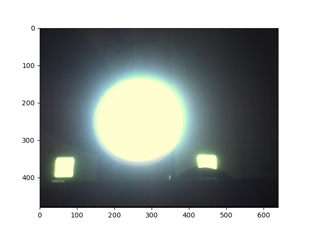
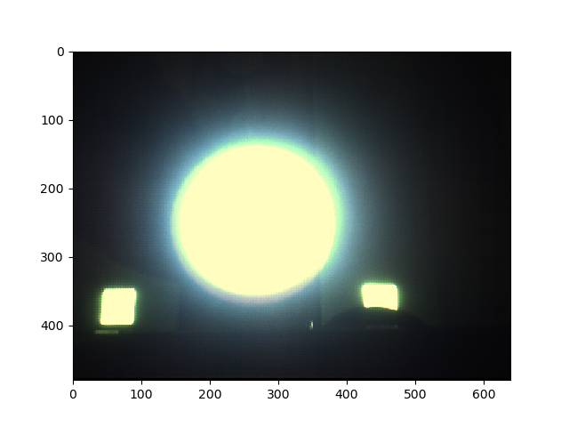

# Image Pipeline

The image pipeline takes raw image from sensor and convert it to meaningful image. Several algorithms like debayering, Black Level correction, auto-white balance, denoising.. will be first implemented to construct a meaningful image. Then additional algorithms can be implemented on the constructed image to post-process it. Like Flipping, blending and overlaying images. All algorithms will be implemented on a static raw image captured from a sensor. The first part of this project is similar to what happens in an ISP (Image Signal Processor) in which all algorithms are designed based on hardware, but we will be designing those such that they are hardware independent.

## CFA Image

## Debayering
Debayering, also known as demosaicing, is the process to convert a CFA image (m-by-n) to a true RGB color digital image (m-by-n-by-3).

## White Balancing

* Any object can look like any color, depending on the light illuminating it. To reveal the color that we would see as humans, what we need is a reference point, something we know should be a certain color (or more accurately, a certain chromaticity). Then, we can rescale the R, G, B values of the pixel until it is that color. 
* As it is usually possible to identify objects that should be white, we will find a pixel we know should be white (or gray), which we know should have RGB values all equal, and then we find the scaling factors necessary to force each channel's value to be equal. 
* As such, this rescaling process is called white balancing. 
* Once we do this for a single pixel, we will assume that the same illuminant is lighting the entire scene, and use these scaling values for all pixels in the image. 

#### Gray world assumption 
* The <b>Gray World Assumption</b> is a white balance method that assumes that your scene, on average, is a neutral gray. Gray-world assumption hold if we have a good distribution of colors in the scene. Assuming that we have a good distribution of colors in our scene,the average reflected color is assumed to be the color of the light. Therefore, we can estimate the illumination color cast by looking at the average color and comparing it to gray.

* <b>Gray world algorithm</b> produces an estimate of illumination by computing the mean of each channel of the image.

* One of the methods of method of normalization is normalizing to the maximum channel by scaling by ri.

ri = max(avgR + avgG + avgB) / avgi

## Gamma correction
* When twice the number of photons hit the sensor of a digital camera, it receives twice the signal (a linear relationship). However, that’s not how our human eyes work. 
* Instead, we perceive double the amount of light as only a fraction brighter (a non-linear relationship)! 
* Furthermore, our eyes are also much more sensitive to changes in dark tones than brighter tones (another non-linear relationship).
* In order to account for this we can apply gamma correction, a translation between the sensitivity of our eyes and sensors of a camera.

#### Gamma correction and the Power Law Transform

* Gamma correction is also known as the Power Law Transform. 
* First, our image pixel intensities must be scaled from the range [0, 255] to [0, 1.0]. From there, we obtain our output gamma corrected image by applying the following equation:

   O = I (1 / G)

   Where <b>I</b> is our input image and <b>G</b> is our gamma value. The output image <b>O</b> is then scaled back to the range [0, 255].

* <b>Gamma values < 1</b> will shift the image towards the <b>darker</b> end of the spectrum while <b>gamma values > 1</b> will make the image appear <b>lighter</b>.

#### Gamma value less than 1

#### Gamma value greater than 1

