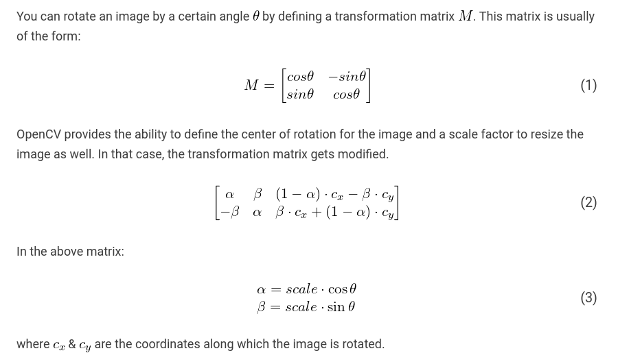

# Image Pipeline

<!-- TABLE OF CONTENTS -->
# Table of Contents

- [Image Pipeline](#sketch-2-paint)
  - [Table of Contents](#table-of-contents)
- [About The Project](#about-the-project)
  - [Aim](#aim)
  - [Description](#description)
  - [Tech Stack](#tech-stack)
  - [File Structure](#file-structure)
- [Getting Started](#getting-started)
  - [Prerequisites](#prerequisites)
  - [Installation](#installation)
- [Usage](#usage)
- [Theory and Approach](#theory-and-approach)
- [Results and Demo](#results-and-demo)
- [Future Works](#future-works)
- [Contributors](#contributors)
- [Acknowledgements and Resources](#acknowledgements-and-resources)
- [License](#license)
<!-- About The Project -->
# About The Project
<!-- Aim -->
## Aim
* JPEG images are the 'ready to view' processed outputs from a camera. 
* In computational photography, it can be useful to work directly with the raw sensor data from a digital camera. 
* So-called RAW processing and RAW files must generally be processed before they can be displayed. 
* In this project, we will implement our own RAW image reader

## Description
* The image pipeline takes raw image from sensor and convert it to meaningful image. Several algorithms like debayering, Black Level correction, auto-white balance, denoising.. will be first implemented to construct a meaningful image. 
* Then additional algorithms can be implemented on the constructed image to post-process it. Like Flipping, blending and overlaying images. 
* All algorithms will be implemented on a static raw image captured from a sensor. 
* The first part of this project is similar to what happens in an ISP (Image Signal Processor) in which all algorithms are designed based on hardware, but we will be designing those such that they are hardware independent.

## Tech Stack
This section contains the technologies we used for this project.
* C++
* OpenCV
* Python

## File Structure

    ├── assets                   # Folder containing pngs
    ├── notes                    # Notes of Debayering and other algorithms
    ├── rawimages                # RAW Images used for testing
    ├── src                      # Source code files        
        ├── CMakeLists.txt
        ├── auto_exposure.cpp
        ├── auto_white_balance.cpp
        ├── black_level_correction.cpp
        ├── color_space_conversion.cpp
        ├── conversion.cpp
        ├── create_image.cpp
        ├── dcraw.c
        ├── debayering.cpp
        ├── edges.cpp
        ├── filters.cpp
        ├── gamma.cpp
        ├── main.cpp
        ├── morphology.cpp
        ├── read_image.py
    ├── include                  # Header files
        ├── auto_exposure.h
        ├── auto_white_balance.h
        ├── black_level_correction.h
        ├── color_space_conversion.h
        ├── conversion.h
        ├── create_image.h
        ├── debayering.h
        ├── edges.h
        ├── filters.h
        ├── gamma.h         
    ├── LICENSE                  # MIT license
    ├── README.md                # readme.md

# Getting Started

## Prerequisites
To download and use this code, the minimum requirements are:

* [OpenCV](https://opencv.org/releases/)
* Windows 7 or later (64-bit), Ubuntu 20.04 or later
* [Microsoft VS Code](https://code.visualstudio.com/download)

## Installation
Clone the repo

` git clone https://github.com/HAWKEYE-HS/Image_Pipeline`

## Usage
Once the requirements are satisfied, you can easily download the project and use it on your machine.

1) First navigate to the folder Image_Pipeline
2) `mkdir build`
3) `cd build`
4) `cmake ../src`
5) `make`
6) `dcraw -4 -d -v -T <raw_file_name>`
6) `../bin/working  <gamma_value> <path_to_image_file (.tiff file)>`

## Theory and Approach
Refer [this](/notes/THEORY.md) for more info

### Debayering

* Debayering, also known as demosaicing, is the process to convert a CFA image (m-by-n) to a true RGB color digital image (m-by-n-by-3).
* Refer [this](/notes/DEBAYERING.md) for more info on debayering.

### Black Level Correction
Black level leads to the whitening of image's dark region and perceived loss of overall contrast
So the goal of this algorithm is to make Black to be Black

### White Balance 
* Any object can look like any color, depending on the light illuminating it. To reveal the color that we would see as humans, what we need is a reference point, something we know should be a certain color (or more accurately, a certain chromaticity). Then, we can rescale the R, G, B values of the pixel until it is that color. 
* As it is usually possible to identify objects that should be white, we will find a pixel we know should be white (or gray), which we know should have RGB values all equal, and then we find the scaling factors necessary to force each channel's value to be equal. 
* As such, this rescaling process is called white balancing. 

### Auto Exposure
* If too much light strikes the image sensor, the image will be overexposed, washed out, and faded.
* If too little light reaches the camera sensor produces an underexposed image, dark and lacking in details, especially in shadow areas.
* Image channel having normalized values in the range 0-1 is run through a loop where each pixel value is compared to the mean intensity value of the image and correction is applied accordingly

### Auto Adjustment
* Brightness and contrast is linear operator with parameter `alpha` and `beta`

`O(x,y) = alpha * I(x,y) + beta`

* Looking at histogram, alpha operates as color range amplifier, beta operates as range shift.

* Automatic brightness and contrast optimization calculates alpha and beta so that the output range is 0..255.

`input range = max(I) - min(I)
wanted output range = 255;
alpha = output range / input range =  255 / ( max(I) - min(I) )`

* You can calculate beta so that min(O) = 0;

`min(O) = alpha * min(I) + beta
beta = -min(I) * alpha`

### Gamma Correction
* Gamma correction is also known as the Power Law Transform. 
* First, our image pixel intensities must be scaled from the range [0, 255] to [0, 1.0]. From there, we obtain our output gamma corrected image by applying the following equation:

   O = I (1 / G)

   Where <b>I</b> is our input image and <b>G</b> is our gamma value. The output image <b>O</b> is then scaled back to the range [0, 255].

### RGB --> Grayscale

* The best method is the luminosity method that successfully solves the problems of previous methods.

* Based on the aforementioned observations, we should take a weighted average of the components. The contribution of blue to the final value should decrease, and the contribution of green should increase. 
* After some experiments and more in-depth analysis, researchers have concluded in the equation below:

`grayscale = (0.3 * R + 0.59 * G + 0.11 * B)/3`

### Grayscale --> Binary

* Binary images are images whose pixels have only two possible intensity values. They are normally displayed as black and white. 
* Numerically, the two values are often 0 for black, and either 1 or 255 for white.

* Binary images are often produced by thresholding a grayscale or color image, in order to separate an object in the image from the background.

### RGB --> HSV

* HSV – (hue, saturation, value), also known as HSB (hue, saturation, brightness), is often used by artists because it is often more natural to think about a color in terms of hue and saturation than in terms of additive or subtractive color components. 
* HSV is a transformation of an RGB colorspace, and its components and colorimetry are relative to the RGB colorspace from which it was derived.

### Sobel Edge Detection

* An edge in an image is a significant local change in the image intensity. As the name suggests, edge detection is the process of detecting the edges in an image.
* The Sobel operator performs a 2-D spatial gradient measurement on an image and so emphasizes regions of high spatial frequency that correspond to edges. Typically it is used to find the approximate absolute gradient magnitude at each point in an input grayscale image.
* In theory at least, the operator consists of a pair of 3×3 convolution kernels. One kernel is simply the transpose of other.
* These kernels are designed to respond maximally to edges running vertically and horizontally relative to the pixel grid, one kernel for each of the two perpendicular orientations.

### Morphological Operations

#### Erosion
* The basic idea of erosion is just like soil erosion only, it erodes away the boundaries of foreground object (Always try to keep foreground in white).
* The kernel slides through the image (as in 2D convolution). 
* A pixel in the original image (either 1 or 0) will be considered 1 only if all the pixels under the kernel is 1, otherwise it is eroded (made to zero).

#### Dilation
* Opposite of erosion. 
* Here, a pixel element is '1' if at least one pixel under the kernel is '1'. So it increases the white region in the image or size of foreground object increases. 

#### Closing
* <b>Reverse of Opening</b>, Dilation followed by Erosion. 
* It is useful in closing small holes inside the foreground objects, or small black points on the object. 

#### Opening

Opening is just another name of <b>erosion</b> followed by <b>dilation</b>. It is useful in removing noise, as we explained above.

#### Gradient
* It is the <b>difference</b> between <b>dilation</b> and <b>erosion</b> of an image.

* The result will look like the <b>outline</b> of the object.

### Blurring
* Image blurring is achieved by convolving the image with a low-pass filter kernel. 
* It is useful for removing noise. 
* It actually removes high frequency content (eg: noise, edges) from the image. 
* So edges are blurred a little bit in this operation (there are also blurring techniques which don't blur the edges). 

#### 1. Averaging

* This is done by convolving an image with a normalized box filter. 
* It simply takes the average of all the pixels under the kernel area and replaces the central element. 

#### 2. Gaussian Blur
* In Gaussian Blur operation, the image is convolved with a Gaussian filter instead of the box filter. 
* The Gaussian filter is a low-pass filter that removes the high-frequency components.

#### 3. Median Blur
* Here, the function takes the median of all the pixels under the kernel area and the central element is replaced with this median value. 
* This is highly effective against salt-and-pepper noise in an image.

### Rotation

## Results and Demo
### Preprocessing Results
RAW Image           |  Preprocessed Image
:-------------------------:|:-------------------------:
<image src="assets/image3o.png" alt = "Image1" width = 350 height="200">  | <image src="assets/image3.png" alt = "PreImage" width = 350 height="200"> 
<image src="assets/imageoutput2.png" alt = "Image1" width = 350 height="200">  | <image src="assets/imageoutput1.png" alt = "PreImage" width = 350 height="200">
<image src="assets/image2o.png" alt = "Image1" width = 350 height="200">  | <image src="assets/image2.png" alt = "PreImage" width = 350 height="200">
<image src="assets/image4.png" alt = "Image1" width = 350 height="200">  | <image src="assets/image4o.png" alt = "PreImage" width = 350 height="200">
<image src="assets/flash.png" alt = "Image1" width = 350 height="200">  | <image src="assets/flasho.png" alt = "PreImage" width = 350 height="200">

### Post-Processing
Grayscale Conversion             |  Binary conversion
:-------------------------:|:-------------------------:
<image src="assets/gray.png" alt = "gray" width = 350>  | <image src="assets/binary.png" alt = "grayscale" width = 350> 

HSV Conversion             |   Sobel Edge Detection
:-------------------------:|:-------------------------:
<image src="assets/hsv.png" alt = "HSV" width = 350>  | <image src="assets/edges.png" alt = "Edges" width = 350> 

Erosion          |  Dilation
:-------------------------:|:-------------------------:
<image src="assets/erode.png" alt = "Erode" width = 350>  | <image src="assets/dilate.png" alt = "Dilate" width = 350> 

Opening             |  Closing
:-------------------------:|:-------------------------:
<image src="assets/opening.png" alt = "Opening" width = 350>  | <image src="assets/closing.png" alt = "Closing" width = 350> 

Gradient             |  Mean Filter
:-------------------------:|:-------------------------:
<image src="assets/gradient.png" alt = "Gradient" width = 350>  | <image src="assets/meanblur.png" alt = "MeanBlur" width = 350> 

Gaussian Filter            |  Median Filter
:-------------------------:|:-------------------------:
<image src="assets/gaussianblur.png" alt = "GaussianBlur" width = 350>  | <image src="assets/median.png" alt = "Median" width = 350>

Original Image            |  Rotated Image(120o)
:-------------------------:|:-------------------------:
<image src="assets/median.png" alt = "GaussianBlur" width = 350>  | <image src="assets/Rotated.png" alt = "Median" width = 350>

## Future Works
We enjoyed working on this project, got to know more about image representation. We will try to
1) Implement the library functions of OpenCV
2) Extend the functionality to dynamic images.  

## Contributors
* [Om Doiphode](https://github.com/HAWKEYE-HS)
* [Kedar Dhamankar](https://github.com/KedarDhamankar)

## Acknowledgements and Resources

* [SRA VJTI](https://sravjti.in/) Eklavya Project 2022

* Referred [this](https://www.google.com/url?sa=t&source=web&rct=j&url=https://www.ipol.im/pub/art/2011/g_mhcd/article.pdf&ved=2ahUKEwiA_s3fzbb6AhUS8jgGHceSBo8QFnoECAsQAQ&usg=AOvVaw0Z6FMrGqqslKOP7gmv9Y38) for Demosaicing algorithm.

* Referred [this](https://www.google.com/url?sa=t&source=web&rct=j&url=http://dev.ipol.im/~nmonzon/Normalization.pdf&ved=2ahUKEwjK_q2F0bb6AhWUzjgGHUwGAIYQFnoECBcQAQ&usg=AOvVaw0Plz9s7KzA0SiCftLdy0oC) for Normalization of image

* Referred [this](https://www.codeproject.com/Articles/653355/Color-Constancy-Gray-World-Algorithm) for White Balancing Algorithm 
* Referred [this](https://link.springer.com/article/10.1007/s11042-019-08318-1) for Auto Exposure Algorithm 

* Referred [this](https://www.cambridgeincolour.com/tutorials/gamma-correction.htm) for gamma correction 

* Referred [this](https://docs.opencv.org/4.x/d9/d61/tutorial_py_morphological_ops.html) for morphological operations.

* Referred [this](https://docs.opencv.org/4.x/d4/d13/tutorial_py_filtering.html) for Blurring algorithms.

* Referred [this](https://medium.com/@haidarlina4/sobel-vs-canny-edge-detection-techniques-step-by-step-implementation-11ae6103a56a) for Sobel Edge Detection.

* Special Thanks to our awesome mentors [Kunal Agarwal](https://github.com/KunalA18) and [Rishabh Bali](https://github.com/Ris-Bali) who always helped us during our project journey

## License
The [License](/LICENSE) for this project
