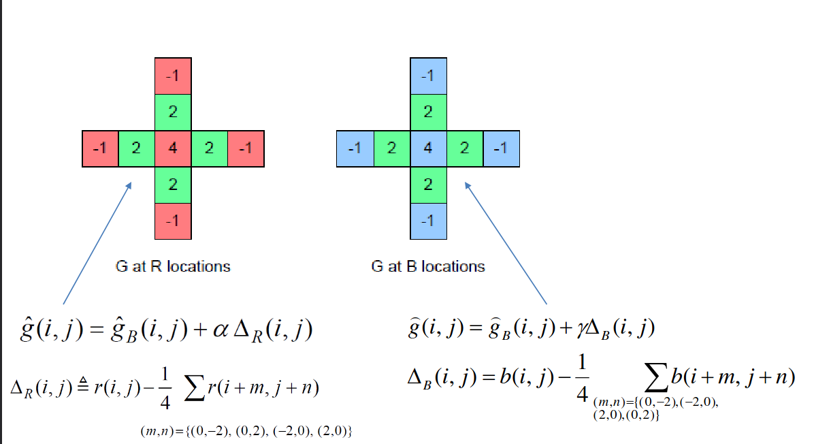
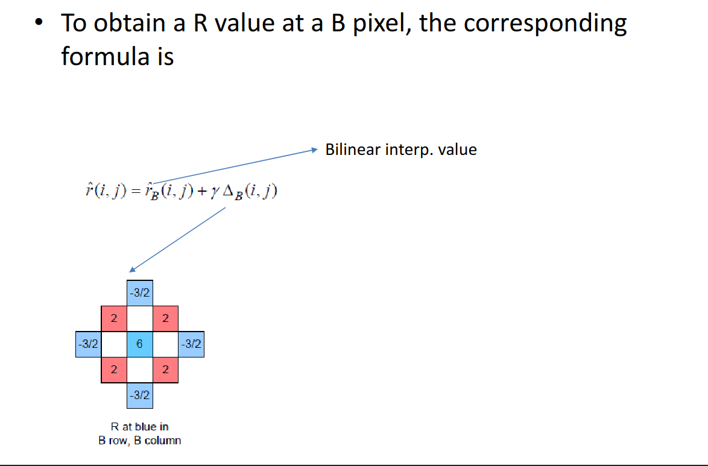
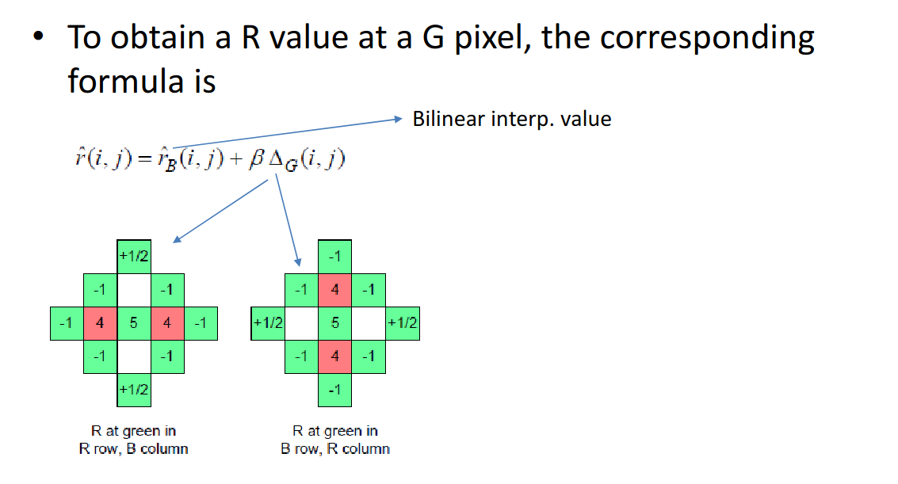

### Debayering

#### Color Filter Arrays

* It is an array of tiny color filters placed before
the image sensor array of a camera.
* The resolution of this array is the same as that
of the image sensor array.
* Each color filter may allow a different
wavelength of light to pass – this is pre-
determined during the camera design.
* The most common type of CFA is the Bayer
pattern which is shown below:

<i>Profile/Cross-section of sensor</i>
* The Bayer pattern collects information at red,
green, blue wavelengths only as shown above.
* The Bayer pattern uses twice the number of green
elements as compared to red or blue elements.
* This is because both the M and L cone cells of the retina are
sensitive to green light.
* The raw (uncompressed) output of the Bayer pattern is
called as the <b>Bayer pattern image</b> or the <b>mosaiced (*)
image.</b>
* The mosaiced image needs to be converted to a normal
RGB image by a process called color image <b>demosaicing.</b>

1. Original scene
2. Output of a 120×80-pixel sensor with a Bayer filter
3. Output color-coded with Bayer filter colors
4. Reconstructed image after interpolating missing color information
5. Full RGB version at 120×80-pixels for comparison (e.g. as a film scan, Foveon or pixel shift image might appear)

### Demosaicing algorithm
* Demosaicing involves interpolation of missing
color values from nearby pixels.
* There exist a plethora of demosaicing algorithms.
* We will be seeing two algorithms here, <b>Bilinear interpolation</b> and its modified version, <b>Malvar-He-Cutler Linear Image demosaicing</b>

#### Bilinear Interpolation
* Bilinear interpolating is the easiest method we can use to demosaic a Bayer image. 
* The idea behind this method is that since there is a high probability that the value of a missed pixels has a similarity to the value of its existing adjacent pixels, we can interpolate the missed values in each channel by taking the average of its adjacent pixels. 
* In other words, we start from the red channel, and for any missed values, we take a look over its adjacent pixels and if they contain a value, we take their average and assign the calculated average to the missed pixel.

As shown above, we can use the following equations to interpolate the values of Gx, Bx, and Rx:

#### Malvar-He-Cutler Algorithm

* The idea behind high-quality interpolation is that for interpolating the missed pixels in each channel, it might not be accurate to use only the adjacent pixels located on the same channel. 
* In other words, for interpolating a green pixel such as Gx in Fig.2, we need to use the value of its adjacent green pixels as well as the value of the existing channel. 
* For example, if at the location of Gx, we have a red value, we have to use that value as well as the adjacent available green values. They called their method gradient correction interpolation.

* Finally, they came up with 8 different 5*5 filters. We need to convolve the filters to pixels that we want to interpolate.

* The method is derived as a modification of bilinear interpolation. Let R, G, B denote the red, green,
and blue channels. At a red or blue pixel location, the bilinear interpolation of the green component
is the average of its four axial neighbors,

^Gbl (i, j) = 1/4
(G(i − 1, j) + G(i + 1, j) + G(i, j − 1) + G(i, j + 1)).

* Bilinear interpolation of the red and blue components is similar, but using instead the four
diagonal neighbors.
* The visual quality of bilinear demosaicking is generally quite poor. Since the channels are in-
terpolated independently, the misalignments near edges produce strong color distortions and zipper
artifacts.
* To improve upon the quality of the bilinear method, Malvar, He, and Cutler follow the work of
Pei and Tam by adding Laplacian cross-channel corrections.
* Consider the case of finding G at an R or a B pixel.
* If the actual R value differs considerably from the linearly
interpolated R value, it means that there is a sharp luminance
change at that pixel.
* The green component at a red pixel
location is estimated as

G(i, j) = ˆGbl (i, j) + α∆R(i, j),

where ∆R is the discrete 5-point Laplacian of the red channel,

∆R(i, j) := R(i, j) − 1/4
(R(i − 2, j) + R(i + 2, j) + R(i, j − 2) + R(i, j + 2)).

* To estimate a red component at a green pixel location,

ˆR(i, j) = ˆRbl (i, j) + β∆G(i, j)

where ∆G is a discrete 9-point Laplacian of the green channel.

* To estimate a red component at a blue pixel location,

ˆR(i, j) = ˆRbl (i, j) + γ∆B (i, j),

where ∆B is the discrete 5-point Laplacian of the blue channel. 
* By symmetry, blue components are
estimated in a manner similar to the estimation of the red components. These formulas are shown
in more detail in the next section.

* The parameters α, β and γ control the weight of the Laplacian correction terms. To set these
parameters optimally, the values producing the minimum mean squared error over the Kodak image
suite were computed. These values were then rounded to dyadic rationals to obtain

α = 1/2 , β = 5/8 , γ = 3/4.

* The advantage of this rounding is that the filters may be efficiently implemented with integer
arithmetic and bitshifting. The filters approximate the optimal Wiener filters within 5% in terms of
mean squared error for a 5 × 5 support.
* The demosaicking is implemented by convolution with a set of linear filters. There are eight
different filters for interpolating the different color components at different locations. 
* For example, at a green pixel location in a red row, the red component is interpolated by

R(i, j) = 1/8
( &nbsp;&nbsp;&nbsp;&nbsp;&nbsp;&nbsp;&nbsp;&nbsp;&nbsp;&nbsp;&nbsp;&nbsp;&nbsp;&nbsp;&nbsp;&nbsp;&nbsp;&nbsp;&nbsp;&nbsp;&nbsp;&nbsp;&nbsp;&nbsp;&nbsp;&nbsp;&nbsp;&nbsp;&nbsp;&nbsp;&nbsp;&nbsp;&nbsp;&nbsp;1/2 G(i, j − 2)
  
  &nbsp;&nbsp;&nbsp;&nbsp;&nbsp;&nbsp;&nbsp;&nbsp;&nbsp;&nbsp;&nbsp;&nbsp;&nbsp;&nbsp;&nbsp;&nbsp;&nbsp;&nbsp;&nbsp;−G(i − 1, j − 1) &nbsp;&nbsp;&nbsp;&nbsp;&nbsp;&nbsp;&nbsp;&nbsp;&nbsp;&nbsp;&nbsp;&nbsp;&nbsp;&nbsp;&nbsp;&nbsp;&nbsp;&nbsp;&nbsp;&nbsp;&nbsp;&nbsp;&nbsp;&nbsp;&nbsp;&nbsp;&nbsp;&nbsp;&nbsp;&nbsp;&nbsp;&nbsp;&nbsp;&nbsp;&nbsp;&nbsp;&nbsp;&nbsp;&nbsp;&nbsp;&nbsp;−G(i + 1, j − 1)

&nbsp;&nbsp;−G(i − 2, j) &nbsp;&nbsp;&nbsp;&nbsp;+&nbsp;&nbsp; 4R(i − 1, j) &nbsp;&nbsp;&nbsp;+&nbsp;&nbsp;&nbsp;&nbsp; 5G(i, j) &nbsp;&nbsp;&nbsp;+ &nbsp;&nbsp;&nbsp;&nbsp;4R(i + 1, j) &nbsp;&nbsp;+&nbsp;&nbsp; −G(i + 2, j)

&nbsp;&nbsp;&nbsp;&nbsp;&nbsp;&nbsp;&nbsp;&nbsp;&nbsp;&nbsp;&nbsp;&nbsp;&nbsp;&nbsp;&nbsp;&nbsp;&nbsp;&nbsp;&nbsp;&nbsp;&nbsp;&nbsp;&nbsp;−G(i − 1, j + 1) &nbsp;&nbsp;&nbsp;&nbsp;&nbsp;&nbsp;&nbsp;&nbsp;&nbsp;&nbsp;&nbsp;&nbsp;&nbsp;&nbsp;&nbsp;&nbsp;&nbsp;&nbsp;&nbsp;&nbsp;&nbsp;&nbsp;&nbsp;&nbsp;&nbsp;&nbsp;&nbsp;&nbsp;&nbsp;&nbsp;&nbsp;&nbsp;&nbsp;&nbsp;&nbsp;&nbsp;−G(i + 1, j + 1)

&nbsp;&nbsp;&nbsp;&nbsp;&nbsp;&nbsp;&nbsp;&nbsp;&nbsp;&nbsp;&nbsp;&nbsp;&nbsp;&nbsp;&nbsp;&nbsp;&nbsp;&nbsp;&nbsp;&nbsp;&nbsp;&nbsp;&nbsp;&nbsp;&nbsp;&nbsp;&nbsp;&nbsp;&nbsp;&nbsp;&nbsp;&nbsp;&nbsp;&nbsp;&nbsp;&nbsp;&nbsp;&nbsp;&nbsp;&nbsp;&nbsp;&nbsp;&nbsp;&nbsp;&nbsp;&nbsp;&nbsp;&nbsp;+1/2 G(i, j + 2)&nbsp;&nbsp;&nbsp;&nbsp;&nbsp;&nbsp;&nbsp;&nbsp;&nbsp;&nbsp;&nbsp;&nbsp;&nbsp;&nbsp;&nbsp;&nbsp;&nbsp;&nbsp;&nbsp;&nbsp;&nbsp;&nbsp;&nbsp;&nbsp;&nbsp;&nbsp;&nbsp;&nbsp;&nbsp;&nbsp;&nbsp;&nbsp;&nbsp;&nbsp;&nbsp;&nbsp;&nbsp;&nbsp;&nbsp;&nbsp;&nbsp;&nbsp;&nbsp;&nbsp;&nbsp; ).

* The filters can be implemented using integer arithmetic. Suppose that the input CFA data is
given as a 2D integer array F (i, j), then the interpolation above can be implemented as

R(i, j) = ( F (i, j − 2) + F (i, j + 2)+
−2(F (i − 1, j − 1) + F (i + 1, j − 1) + F (i − 2, j) + F (i + 2, j) + F (i − 1, j + 1) + F (i + 1, j + 1))+
+8(F (i − 1, j) + F (i + 1, j))+
+10F (i, j) )/16,

and the division by 16 can be efficiently implemented by bitshifting. The other filters are implemented
similarly.

<i>5 x 5 linear filters</i>

